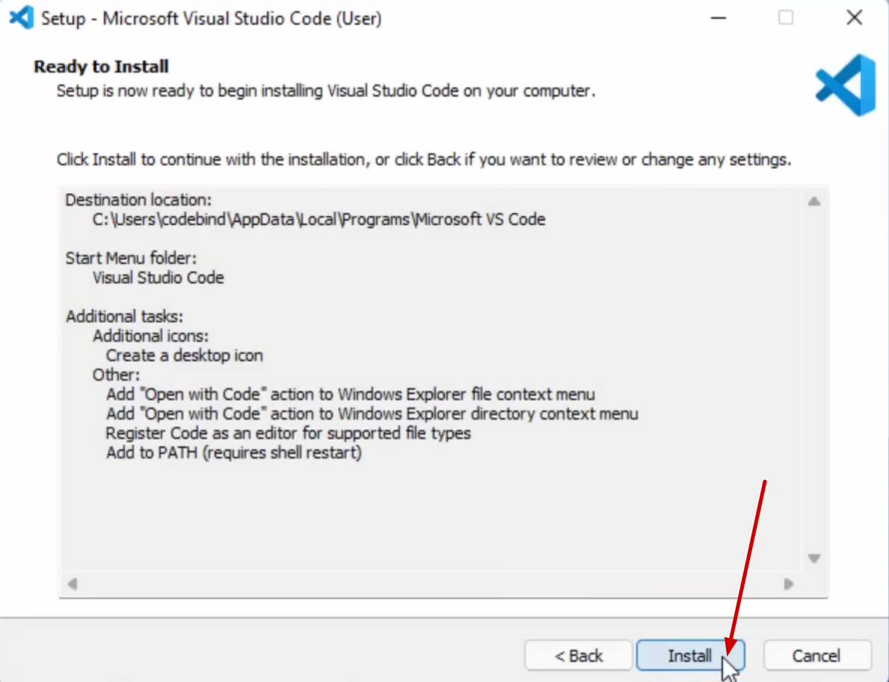

[Als PDF exportieren](https://lionelsemion.github.io/Python-Kurs/handout/handout.pdf)

# Python installieren

**Nur für Windows! Wer macOS oder Linux nutzt, bitte melden.**

## 1. Python herunterladen

Besuche die offizielle Python-Website und lade die neueste Version für Windows herunter:

[https://www.python.org/downloads/](https://www.python.org/downloads/)


## 2. Installationsdatei ausführen

Nach dem Herunterladen die `.exe`-Datei ausführen.

## 3. Wichtige Einstellungen beachten

**WICHTIG:** Vor dem Klicken auf "Install Now" unbedingt "Add python.exe to PATH" aktivieren!

<div style="display: flex; justify-content: space-between;">
    
    
</div>

## 4. Installation abschliessen

Nach der Installation auf "Close" klicken. Die Option "Disable path length limit" kann ignoriert werden.

<div style="page-break-after: always;"></div>

# Visual Studio Code (VS Code) installieren

## 1. VS Code herunterladen

**Auch hier wieder: Nur für Windows! Wer macOS oder Linux nutzt, bitte melden.**

Lade Visual Studio Code von der offiziellen Website herunter:

[https://code.visualstudio.com/download](https://code.visualstudio.com/download)

## 2. Lizenzvereinbarung akzeptieren

Wähle "I accept the agreement" und klicke auf "Next".

<div style="display: flex; justify-content: space-between;">
    
    
</div>

## 3. Installieren

Klicke auf "Next" und dann nochmal auf "Next".

<div style="display: flex; justify-content: space-between;">
    
    
</div>

<div style="page-break-after: always;"></div>

Hier bitte alles auswählen, dann funktioniert VS Code am besten. Klicke anschliessend auf "Next".

<div style="display: flex; justify-content: space-between;">
    
    
</div>

Klicke auf "Install" und warte, bis die Installation abgeschlossen ist.

<div style="display: flex; justify-content: space-between;">
    
    
</div>

Nach der Installation auf "Finish" klicken. VS Code ist jetzt installiert und startet auch gleich.

**Warte jetzt kurz, bis alle fertig sind. Danach gibt's von uns noch eine kurze Einführung, bevor es dann endlich losgeht.**

<div style="page-break-after: always;"></div>

# Jetzt geht's los!

> **Hinweise**
>
> -   Probier die Beispiele aus und schreib sie dir in deinen `spickzettel.py`.
> -   Wenn du Fragen hast, melde dich bitte. Wir helfen gerne!
> -   Falls dein Englisch ein bisschen rostig ist, kannst du jeweils auf den zweiten Link in Klammern gehen für eine Übersetzung. Die Übersetzungen sind teilweise ein bisschen unverständlich, frag einfach bei Unklarheiten!

## 1. Variablen

Gehe auf **[diesen Link](https://www.w3schools.com/python/python_variables.asp)**
([alternativ auf Deutsch](https://www-w3schools-com.translate.goog/python/python_variables.asp?_x_tr_sl=en&_x_tr_tl=de&_x_tr_hl=de&_x_tr_pto=wapp))

Bearbeite die Kapitel

-   "Variable Names"
-   "Assign Multiple Values"
-   "Output Variables"
-   "Variable Exercises"

"Global Variables" ist freiwillig

Auf Deutsch:

-   "Variablennamen"
-   "Mehrere Werte zuweisen"
-   "Ausgabevariablen"
-   "Variable Übungen"

"Globale Variablen" ist freiwillig

## 2. `input()`

Die `input()`-Funktion in Python wird verwendet, um Benutzereingaben zu erhalten. Wenn die Funktion aufgerufen wird, pausiert das Programm und wartet, bis der Benutzer eine Eingabe macht und die Entertaste drückt. Die Eingabe kann dann zum Beispiel in einer Variable gespeichert werden.

```python
name = input("Wie heisst du? ")
print("Hallo, " + name + "!")
```

In diesem Beispiel wird der Benutzer nach seinem Namen gefragt. Die Eingabe wird in der Variablen `name` gespeichert und anschliessend mit einer Begrüssung ausgegeben.

<div style="page-break-after: always;"></div>

## 3. Casting

### Problem: Rechnen mit `input()`

Ein häufiges Problem bei der `input()`-Funktion in Python ist, dass sie die Eingabe immer als Text (String) speichert. Wenn wir mit diesen Eingaben rechnen wollen, kann das zu Fehlern führen.

```python
zahl1 = input("Gib eine Zahl ein: ")
zahl2 = input("Gib eine weitere Zahl ein: ")
summe = zahl1 + zahl2
print("Die Summe ist: " + summe)
```

In diesem Beispiel werden die Eingaben als Text aneinandergehängt. Wenn der Benutzer `3` und `4` eingibt, wird `34` ausgegeben, nicht `7`.

Um das zu vermeiden, müssen wir die Eingaben in Zahlen umwandeln. Das nennt man Casting.

```python
zahl1 = int(input("Gib eine Zahl ein: "))
zahl2 = int(input("Gib eine weitere Zahl ein: "))
summe = zahl1 + zahl2
print("Die Summe ist: " + str(summe))
```

Hier wandeln wir die Eingaben mit `int()` in Ganzzahlen um. Jetzt wird `7` ausgegeben, wenn der Benutzer `3` und `4` eingibt.

### Beispiele für Casting

#### Ganzzahl-Casting

```python
x = int(1)   # x wird 1
y = int(2.8) # y wird 2
z = int("3") # z wird 3
```

#### Float-Casting

```python
x = float(1)     # x wird 1.0
y = float(2.8)   # y wird 2.8
z = float("3")   # z wird 3.0
w = float("4.2") # w wird 4.2
```

<div style="page-break-after: always;"></div>

#### String-Casting

```python
x = str(1)    # x wird '1'
y = str(2.8)  # y wird '2.8'
z = str(3.0)  # z wird '3.0'
```

## 4. Strings

Gehe auf **[diesen Link](https://www.w3schools.com/python/python_strings.asp)**
([alternativ auf Deutsch](https://www-w3schools-com.translate.goog/python/python_strings.asp?_x_tr_sl=en&_x_tr_tl=de&_x_tr_hl=de&_x_tr_pto=wapp))

Die automatische Übersetzung übersetzt "string" als "Saite" - hier wäre eine bessere Übersetzung "Zeichenfolge" :\)

Bearbeite die Kapitel

-   "Slicing Strings"
-   "Modify Strings"
-   "String Concatenation"
-   "String Exercises"

Auf Deutsch:

-   _"Saiten schneiden"_ oder besser **"String schneiden"**
-   "Zeichenfolgen ändern"
-   "Verketten von Zeichenfolgen"
-   _"Saitenübungen"_ oder besser **"String-Übungen"**

## 5. If ... Else ...

Die `if`-Anweisung in Python wird verwendet, um bestimmte Anweisungen nur auszuführen, wenn eine Bedingung erfüllt ist. Das bedeutet, dass ein bestimmter Codeblock nur dann ausgeführt wird, wenn eine bestimmte Bedingung erfüllt ist.

### If-Anweisung

```python
alter = int(input("Wie alt bist du? "))
if alter < 16:
    print("Du bist nicht alt genug")
```

In diesem Beispiel wird die Nachricht "Du bist nicht alt genug" nur dann ausgegeben, wenn man eine Zahl, die kleiner als 16 ist, eingibt.

<div style="page-break-after: always;"></div>

### Else-Anweisung

Die `else`-Anweisung kann verwendet werden, um einen Codeblock auszuführen, wenn die Bedingung der `if`-Anweisung **nicht** erfüllt ist.

```python
temperatur = int(input("Was ist die Temperatur? "))
if temperatur > 30:
    print("Es ist sehr heiss!")
else:
    print("Es ist angenehm oder kühl.")
```

Hier wird die Nachricht "Es ist angenehm oder kühl." ausgegeben, wenn die Temperatur 30 Grad oder weniger beträgt.

### Elif-Anweisung

Die `elif`-Anweisung (kurz für "else if" oder "sonst falls") kann verwendet werden, um mehr Bedingungen zu überprüfen.

```python
uhrzeit = int(input("Wie spät ist es? "))
if uhrzeit < 12:
    print("Guten Morgen!")
elif 12 <= uhrzeit < 18:
    print("Guten Tag!")
else:
    print("Guten Abend!")
```

In diesem Beispiel wird die entsprechende Begrüssung basierend auf der eingegebenen Uhrzeit ausgegeben.

### Logische Operatoren

Logische Operatoren wie "und", "oder" und "nicht" verwenden wir im Deutschen, um verschiedene Aussagen aneinander zu hängen. In Python gibt es das auch.

#### And

Der `and`-Operator wird verwendet, um zu überprüfen, ob mehrere Bedingungen gleichzeitig wahr sind.

```python
alter = int(input("Wie alt bist du? "))
jahre_im_job = int(input("Wie viele Jahre arbeitest du schon in deinem Beruf? "))
if alter > 18 and jahre_im_job > 5:
    print("Du bist erfahren und erwachsen.")
```

<div style="page-break-after: always;"></div>

#### Or

Der `or`-Operator wird verwendet, um zu überprüfen, ob mindestens eine von mehreren Bedingungen wahr ist.

```python
tag = input("Welcher Tag ist heute? ").lower()
if tag == "samstag" or tag == "sonntag":
    print("Es ist Wochenende!")
else:
    print("Es ist ein Wochentag.")
```

#### Not

Der `not`-Operator wird verwendet, um eine Bedingung zu negieren.

```python
regnet_es = input("Regnet es gerade? (ja/nein) ").lower()
if not regnet_es == "ja":
    print("Es regnet nicht. Du kannst ohne Schirm rausgehen.")
else:
    print("Es regnet. Nimm einen Schirm mit.")
```

In diesem Beispiel wird die Nachricht "Es regnet nicht. Du kannst ohne Schirm rausgehen." ausgegeben, wenn die Eingabe nicht "ja" ist.

## 6. While Loops

Eine `while`-Schleife in Python wird verwendet, um einen Codeblock so lange auszuführen, wie eine bestimmte Bedingung wahr ist. Das bedeutet, dass der Code immer wieder ausgeführt wird, bis die Bedingung nicht mehr erfüllt ist.

### Einfaches Beispiel

```python
count = 0
while count < 5:
    print("Die Zahl ist:", count)
    count += 1
```

In diesem Beispiel wird die Zahl von 0 bis 4 ausgegeben. Die Schleife läuft, solange `count` kleiner als 5 ist.

<div style="page-break-after: always;"></div>

### Break

Mit der `break`-Anweisung kannst du eine Schleife vorzeitig beenden, auch wenn die Bedingung noch wahr ist.

```python
count = 0
while count < 10:
    print("Die Zahl ist:", count)
    if count == 5:
        break
    count += 1
```

Hier wird die Schleife beendet, sobald `count` den Wert 5 erreicht, obwohl die Bedingung `count < 10` noch wahr ist.

### Continue

Die `continue`-Anweisung überspringt den aktuellen Durchlauf der Schleife und fährt mit dem nächsten fort.

```python
count = 0
while count < 5:
    count += 1
    if count == 3:
        continue
    print("Die Zahl ist:", count)
```

In diesem Beispiel wird die Zahl 3 übersprungen. Die Schleife fährt mit dem nächsten Durchlauf fort, ohne die Zahl 3 auszugeben.

### Praktisches Beispiel

Stell dir vor, du möchtest ein Passwort eingeben und das Programm soll so lange nach dem Passwort fragen, bis du das richtige eingibst.

```python
password = ""
while password != "ananas":
    password = input("Bitte gib das Passwort ein: ")
    if password == "ananas":
        print("Zugang gewährt!")
    else:
        print("Falsches Passwort, versuche es erneut.")
```

In diesem Beispiel wird das Programm so lange nach dem Passwort fragen, bis du "ananas" eingibst. Dann wird "Zugang gewährt!" ausgegeben.

<div style="page-break-after: always;"></div>

## 7. For Loops

Eine `for`-Schleife in Python wird verwendet, um eine bestimmte Anzahl von Wiederholungen durchzuführen oder über eine Sequenz von Elementen zu iterieren.

Die `range()`-Funktion erzeugt eine Sequenz von Zahlen. In diesem Beispiel wird die Schleife 10 Mal ausgeführt, von 0 bis 9.

```python
for i in range(10):
    print("Die Zahl ist:", i)
```

In diesem Beispiel werden die Zahlen von 0 bis 9 ausgegeben.

Eine `for`-Schleife kann auch verwendet werden, um über die Zeichen in einem String zu _iterieren_.

```python
wort = "Python"
for buchstabe in wort:
    print("Der Buchstabe ist:", buchstabe)
```

In diesem Beispiel wird jeder Buchstabe des Wortes "Python" einzeln ausgegeben.

Mehr zu For Loops gibt's **[hier](https://www.w3schools.com/python/python_for_loops.asp)**
(oder auf Deutsch [hier](https://www-w3schools-com.translate.goog/python/python_for_loops.asp?_x_tr_sl=en&_x_tr_tl=de&_x_tr_hl=de&_x_tr_pto=wapp))

## 8. Funktionen

### Was sind Funktionen?

Funktionen sind wiederverwendbare Codeblöcke, die eine bestimmte Aufgabe ausführen. Sie helfen dabei, den Code sauber und modular zu halten.

### Eine einfache Funktion definieren

Eine Funktion wird mit `def` definiert, gefolgt von einem Namen und Klammern. Der Codeblock der Funktion wird eingerückt.

```python
def begruessung():
    print("Hallo, Welt!")
```

### Eine Funktion aufrufen

Um eine Funktion auszuführen, rufen wir sie einfach mit ihrem Namen und Klammern auf.

```python
begruessung()
```

<div style="page-break-after: always;"></div>

### Funktionen mit Parametern

Funktionen können Parameter akzeptieren, um flexibler zu sein.

```python
def begruessung(name):
    print("Hallo, " + name + "!")
```

```python
begruessung("Sophia")
```

### Rückgabewerte

Funktionen können Werte zurückgeben, die dann weiterverwendet werden können.

```python
def addiere(a, b):
    return a + b
```

```python
ergebnis = addiere(3, 4)
print(ergebnis)  # Ausgabe: 7
```

### Beispiel: Eine Funktion mit mehreren Parametern

```python
def personalisierte_begruessung(name, alter):
    print(f"Hallo, {name}! Du bist {alter} Jahre alt.")
```

```python
personalisierte_begruessung("Jaron", 14)
```

Funktionen sind ein grundlegendes Werkzeug in Python, das dir hilft, deinen Code besser zu organisieren und wiederzuverwenden.

**Das war's mit den Grundlagen von Python.**

# Automatisieren mit Python

Aktuelle Mausposition:

```python
import pyautogui
import keyboard
from time import sleep

stop = False


def on_press(key):
    global stop
    if key.name == "space":
        print(tuple(pyautogui.position()))
    elif key.name == "esc":
        stop = True


keyboard.on_press(on_press)

while not stop:
    sleep(0.1)
```

# Flappy Bird

Tutorial: [https://www.youtube.com/watch?v=6UicVzXe5o8](https://www.youtube.com/watch?v=6UicVzXe5o8)

<div style="page-break-after: always;"></div>
