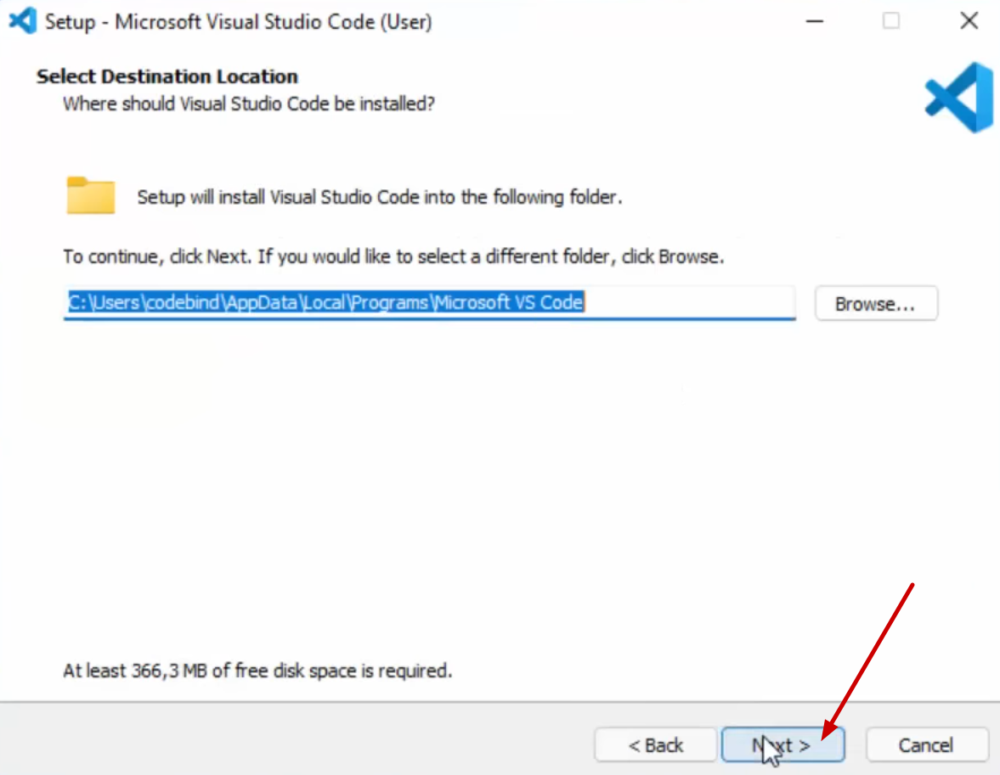
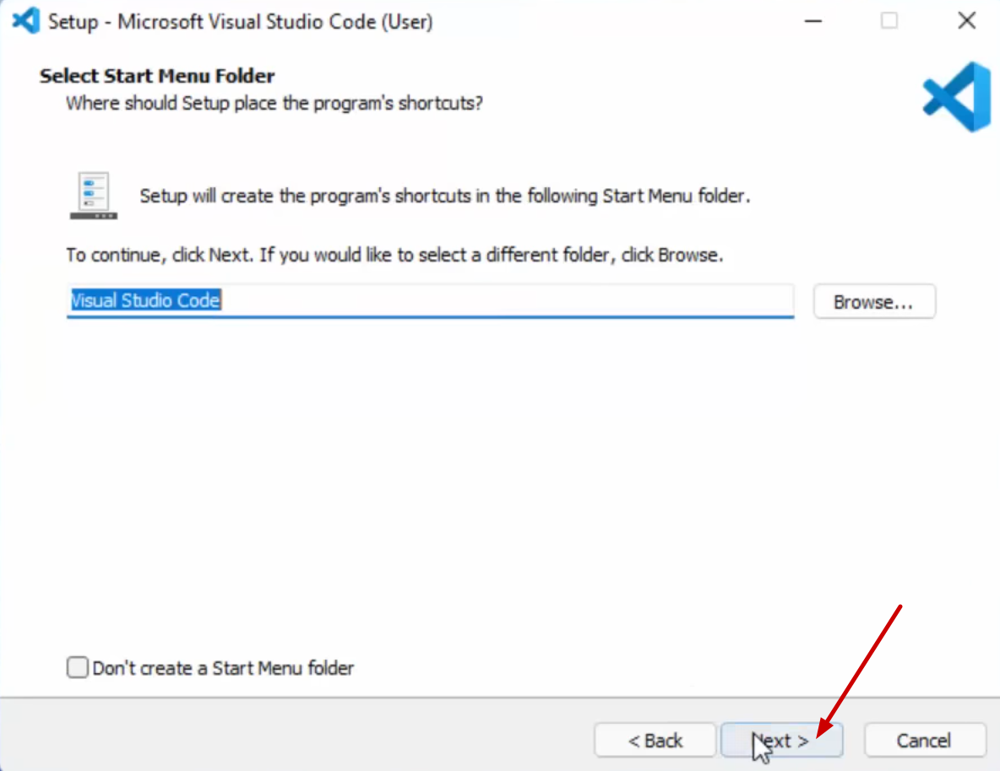

# Python installieren

**Nur für Windows! Wer macOS oder Linux nutzt, bitte melden.**

## 1. Python herunterladen
Besuche die offizielle Python-Website und lade die neueste Version für Windows herunter:

[https://www.python.org/downloads/](https://www.python.org/downloads/)

## 2. Installationsdatei ausführen
Nach dem Herunterladen die `.exe`-Datei ausführen.

## 3. Wichtige Einstellungen beachten
**WICHTIG:** Vor dem Klicken auf "Install Now" unbedingt "Add python.exe to PATH" aktivieren!

    
    

## 4. Installation abschliessen
Nach der Installation auf "Close" klicken. Die Option "Disable path length limit" kann ignoriert werden.

# Visual Studio Code (VS Code) installieren

## 1. VS Code herunterladen

**Auch hier wieder: Nur für Windows! Wer macOS oder Linux nutzt, bitte melden.**

Lade Visual Studio Code von der offiziellen Website herunter:

[https://code.visualstudio.com/download](https://code.visualstudio.com/download)

## 2. Lizenzvereinbarung akzeptieren
Wähle "I accept the agreement" und klicke auf "Next".

    
    

## 3. Installieren
Klicke auf "Next" und dann nochmal auf "Next".

    
    

Hier bitte alles auswählen, dann funktioniert VS Code am besten. Klicke anschliessend auf "Next".

    
    

Klicke auf "Install" und warte, bis die Installation abgeschlossen ist.

    
    

Nach der Installation auf "Finish" klicken. VS Code ist jetzt installiert und startet auch gleich.

