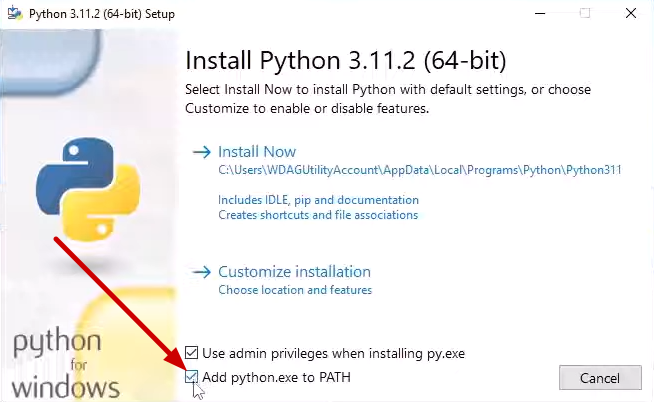
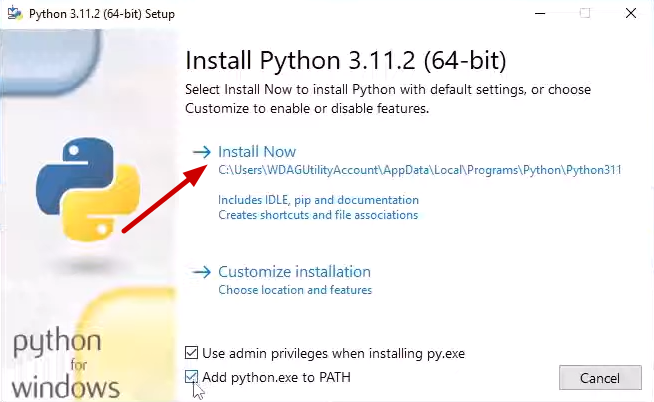
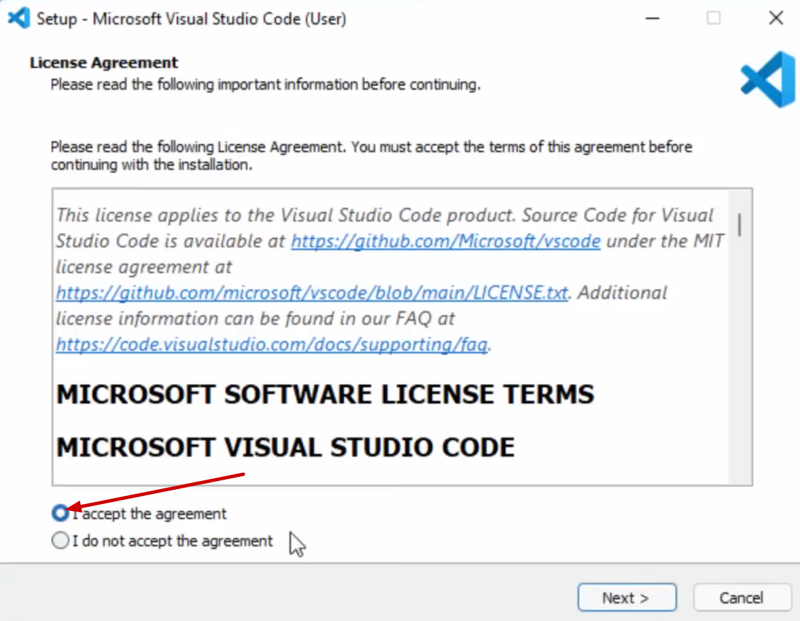
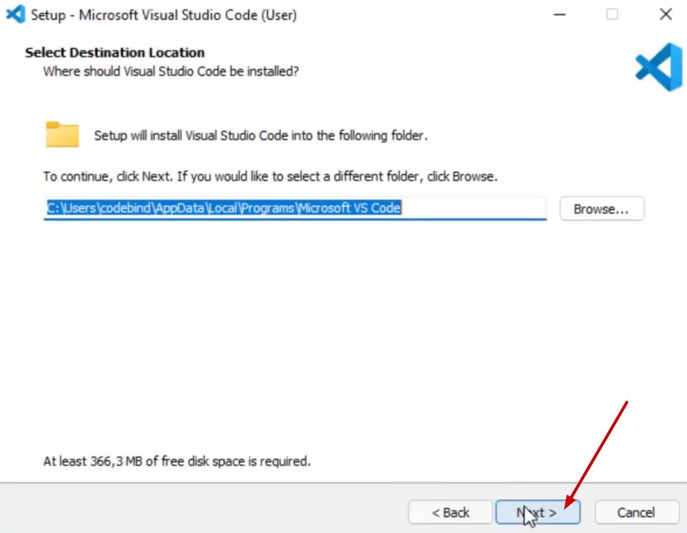
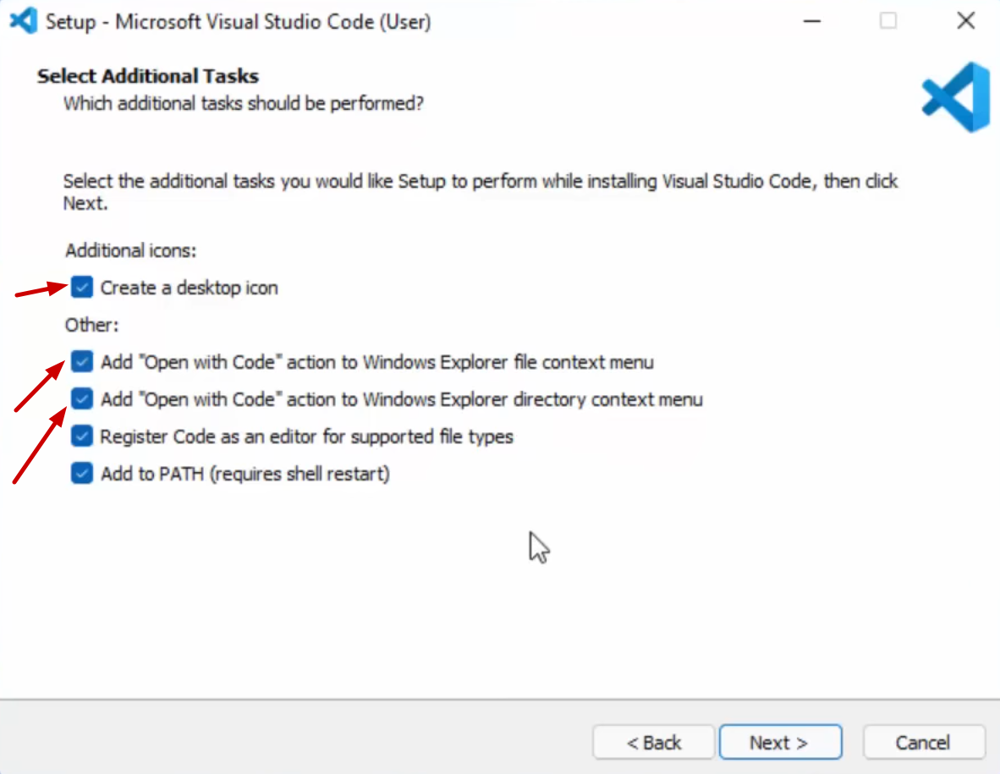
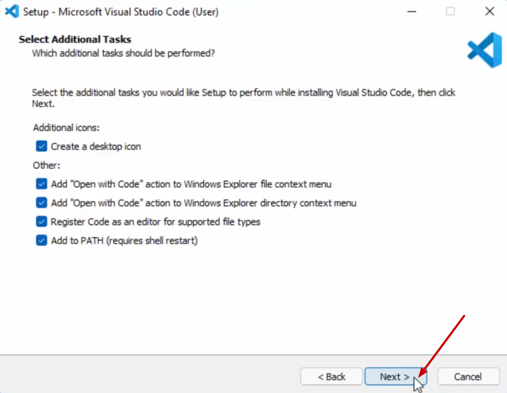
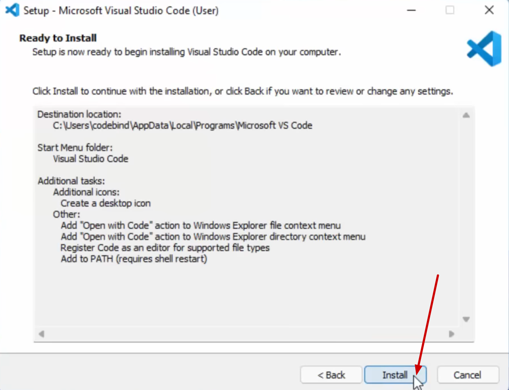
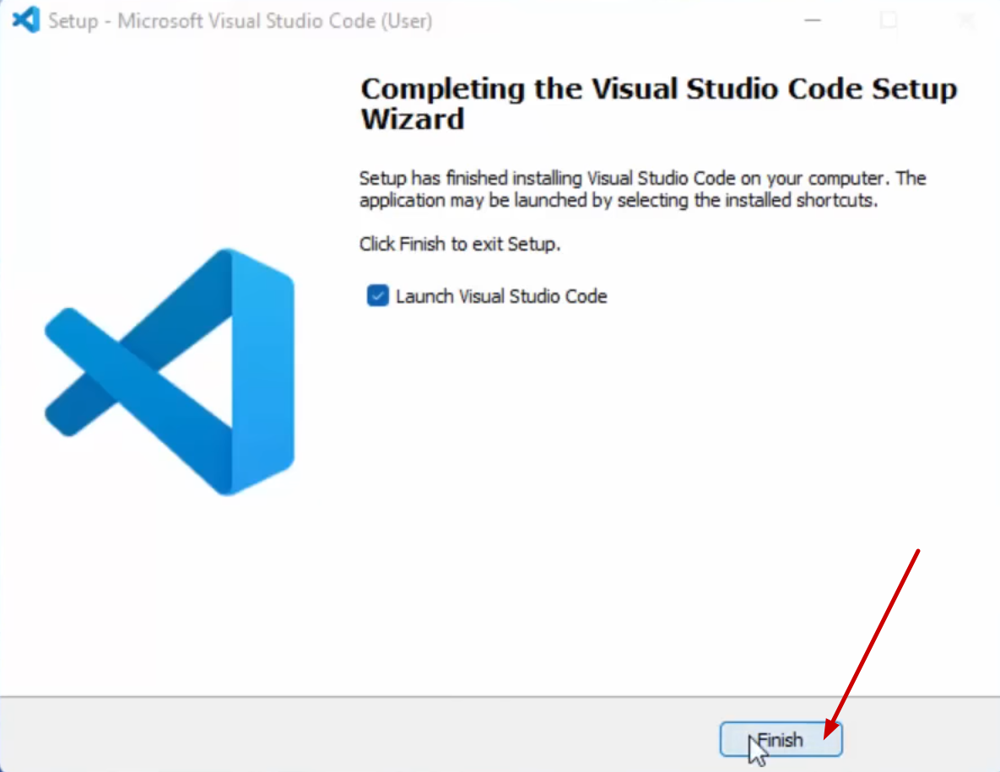
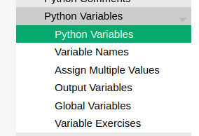

# Python installieren

**Nur für Windows! Wer macOS oder Linux nutzt, bitte melden.**

## 1. Python herunterladen

Besuche die offizielle Python-Website und lade die neueste Version für Windows herunter:

[https://www.python.org/downloads/](https://www.python.org/downloads/)

## 2. Installationsdatei ausführen

Nach dem Herunterladen die `.exe`-Datei ausführen.

## 3. Wichtige Einstellungen beachten

**WICHTIG:** Vor dem Klicken auf "Install Now" unbedingt "Add python.exe to PATH" aktivieren!

    
    

## 4. Installation abschliessen

Nach der Installation auf "Close" klicken. Die Option "Disable path length limit" kann ignoriert werden.

# Visual Studio Code (VS Code) installieren

## 1. VS Code herunterladen

**Auch hier wieder: Nur für Windows! Wer macOS oder Linux nutzt, bitte melden.**

Lade Visual Studio Code von der offiziellen Website herunter:

[https://code.visualstudio.com/download](https://code.visualstudio.com/download)

## 2. Lizenzvereinbarung akzeptieren

Wähle "I accept the agreement" und klicke auf "Next".

    
    

## 3. Installieren

Klicke auf "Next" und dann nochmal auf "Next".

    
    

Hier bitte alles auswählen, dann funktioniert VS Code am besten. Klicke anschliessend auf "Next".

    
    

Klicke auf "Install" und warte, bis die Installation abgeschlossen ist.

    
    

Nach der Installation auf "Finish" klicken. VS Code ist jetzt installiert und startet auch gleich.

**Warte jetzt kurz, bis alle fertig sind. Danach gibt's von uns noch eine kurze Einführung, bevor es dann endlich losgeht.**

# Jetzt geht's los!

> **Hinweise**
>
> - Immer wenn du etwas neues lernst, schreib es dir in deinen `spickzettel.py`
> - Wenn du Fragen hast, melde dich bitte. Wir helfen gerne!
> - Um zu schauen, ob du alles verstanden hast, löse bitte die Übungen am Ende von jedem Kapitel
> - Die Module sind standartmässig auf Englisch, du kannst aber das Übersetzungsfeature von Chrome/Edge/Firefox verwenden, um in deiner Sprache arbeiten zu können.

Gehe auf [https://www.w3schools.com/python/](https://www.w3schools.com/python/) und bearbeite die folgenden Module.

## 1. Variablen (`Variables`)

Bearbeite die folgenden Kapitel

## 2. Zahlen (`Numbers`)

> Alles zu `complex` kannst du ignorieren

## 3. Typumwandlung (`Casting`)

## 4. Zeichenketten (`Strings`)

## 5. Bedingungen (`If ... Else`)

## 6. Schleifen (`While Loops`)

## 7. For-Schleifen (`For Loops`)

## 8. Funktionen (`Functions`)

Ohne "Arbitrary Arguments, \*args", "Arbitrary Keyword Arguments, \*\*kwargs", "Positional-Only Arguments", "Keyword-Only Arguments", "Combine Positional-Only and Keyword-Only" und "Recursion"
